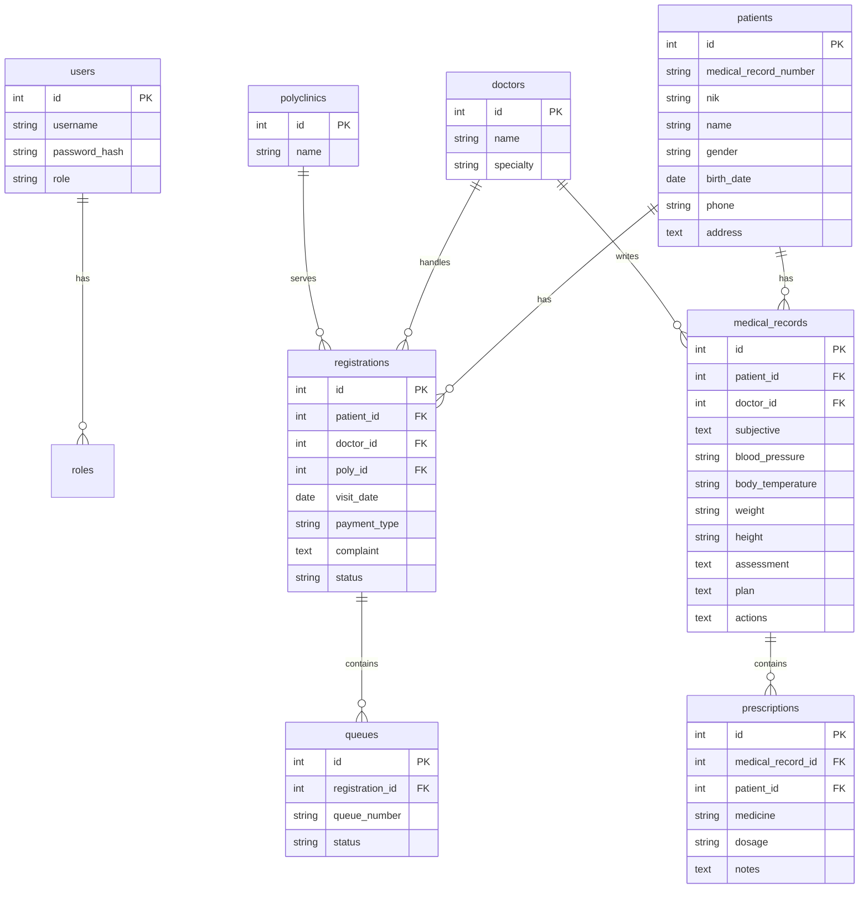

# ERD Mini Clinic Information System

## Keterangan

- Satu pasien dapat memiliki banyak pendaftaran kunjungan.
- Satu pendaftaran kunjungan dapat menghasilkan satu antrean.
- Satu pasien dapat memiliki banyak rekam medis.
- Satu rekam medis dapat memiliki banyak resep obat.
- Role pengguna terbagi menjadi Administrator, Dokter, dan Petugas Pendaftaran.
