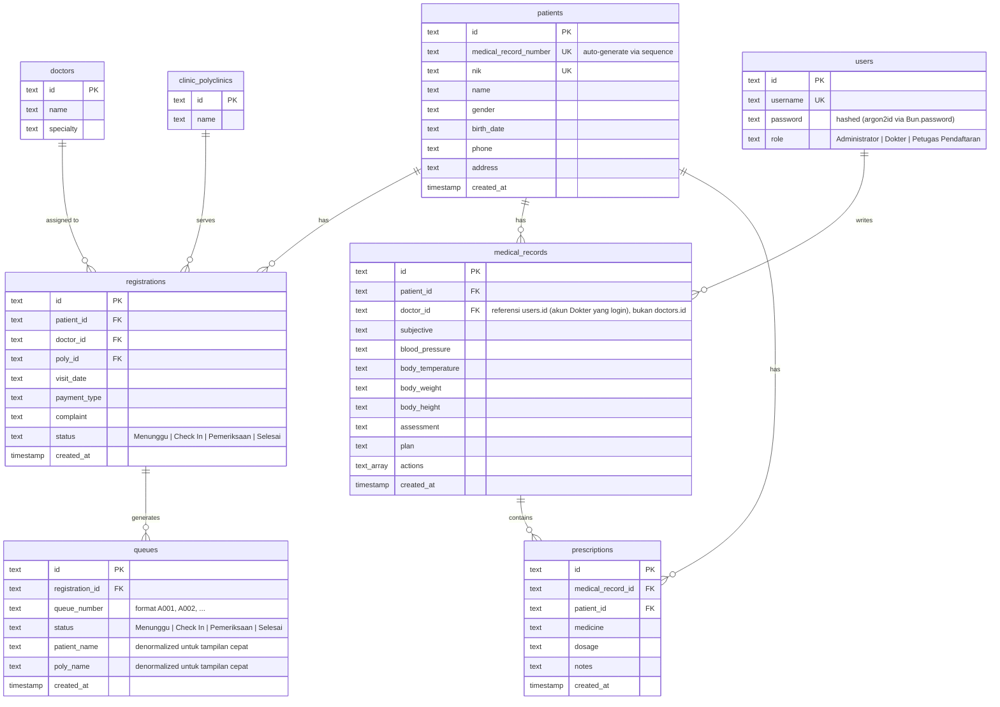

# ERD Mini Clinic Information System

Sesuai implementasi di `database/clinic_schema.sql`. Seluruh primary key & foreign key bertipe `TEXT` (bukan integer auto-increment) — nilai ID dibuat di sisi aplikasi (mis. `p-1001`, `reg-...`).

## Keterangan

- Satu pasien dapat memiliki banyak pendaftaran kunjungan, banyak rekam medis, dan banyak resep.
- Satu pendaftaran kunjungan menghasilkan satu entri antrean (dibuat otomatis oleh backend saat pendaftaran disimpan).
- Satu rekam medis dapat memiliki banyak resep obat.
- `medical_records.doctor_id` merujuk ke `users(id)` — akun yang sedang login sebagai Dokter saat menulis catatan SOAP — **bukan** ke `doctors(id)` (katalog dokter yang dipakai saat memilih dokter di modul Pendaftaran). Ini penyederhanaan yang disengaja karena aplikasi tidak memetakan satu akun login ke satu baris dokter di katalog; lihat bagian "Asumsi & Penyederhanaan" di README.
- Semua foreign key di atas ditegakkan sebagai `REFERENCES` sungguhan di database (bukan hanya konvensi penamaan kolom) — percobaan menghapus baris yang masih direferensikan, atau menyisipkan referensi yang tidak valid, ditolak oleh Postgres dan diterjemahkan backend menjadi response error JSON yang konsisten (`success:false`, HTTP 409).
- `patients.medical_record_number` dijamin unik dan dibuat dari Postgres `SEQUENCE` (`patient_mrn_seq`), bukan `COUNT(*)` — sehingga tetap konsisten walau ada baris pasien yang dihapus.
- Role pengguna: `Administrator`, `Dokter`, `Petugas Pendaftaran`.
